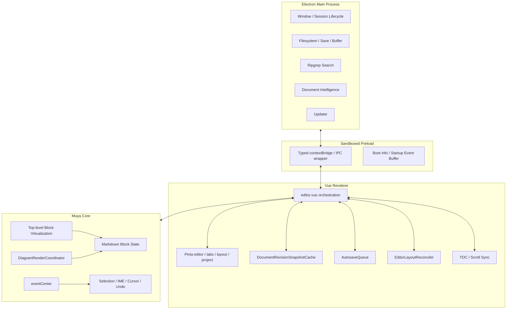
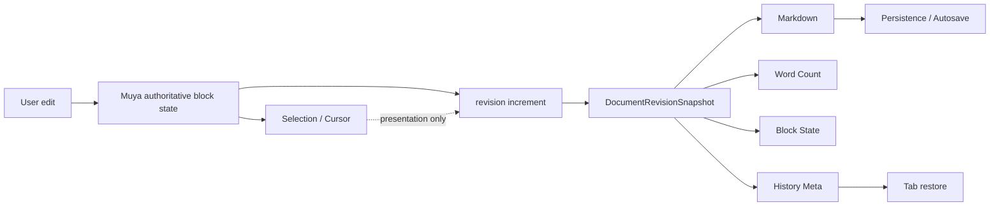
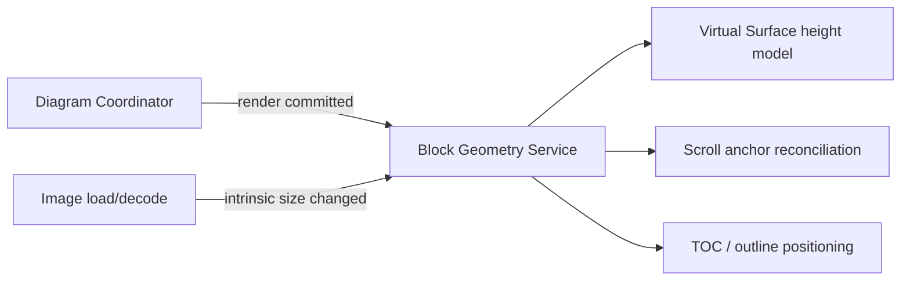
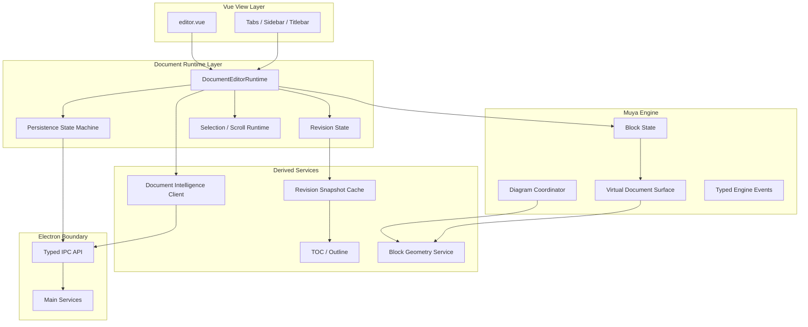
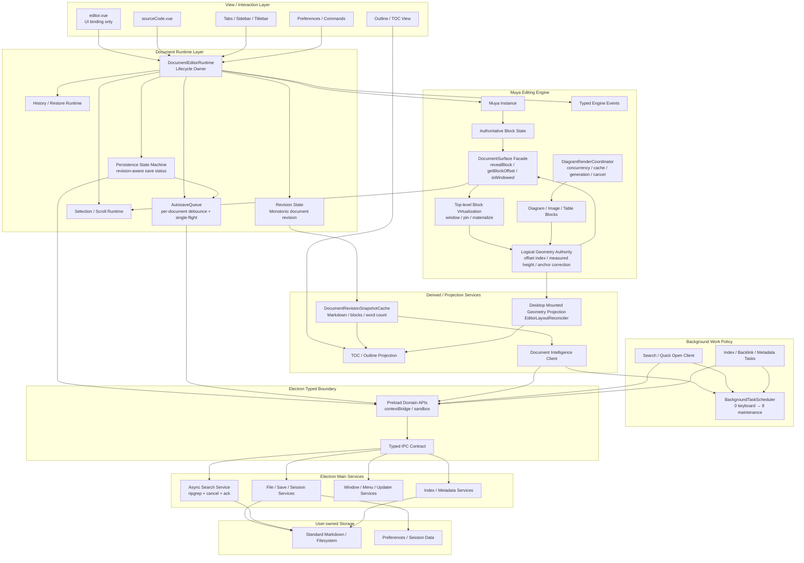
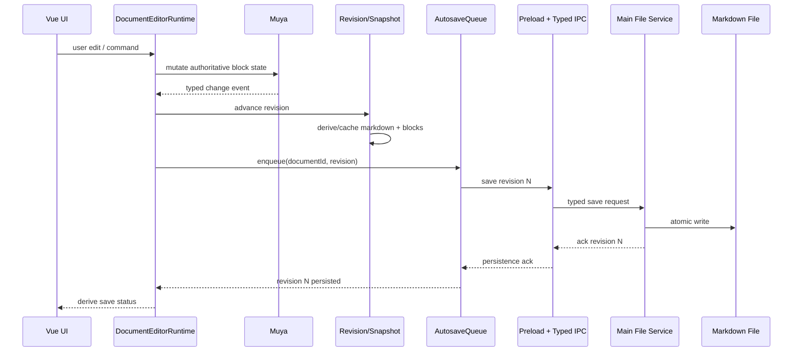
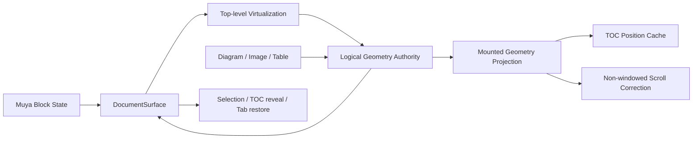

# Inkiva 架构审计（2026-09）

> 审计基线：2026-09-21 远端最新 `develop`，HEAD `b089010f11bb6307e61bcf7a96eb91d6dc9ca5c0`。该基线已包含 PR-C follow-up #153、设置功能门禁 #154 与 PR-C 收口记录 #155。
>
> 本文档只做架构审计与后续重构规划，不代表相应重构已经完成。所有图表均使用 Mermaid。

## 1. Executive Summary

Inkiva 当前已经从原始 MarkText 风格的“功能聚合型桌面应用”开始向更明确的文档编辑器架构收敛，但仍处于**新架构骨架已经出现、核心编排尚未彻底拆分**的阶段。

本轮审计的核心结论是：

1. **编辑器热路径架构已经有实质改善，不应再描述为纯补丁堆叠。**  
   `DocumentRevisionSnapshotCache` 已把 Markdown、word count、blocks、history meta 按 document revision 缓存；PR-C 引入顶层 Block Virtualization；图表有统一的 `DiagramRenderCoordinator`；编辑器 DOM 几何变化有 `EditorLayoutReconciler`。这些都是具备清晰职责边界的架构模块。

2. **当前最大的结构性风险仍在 renderer 编排层。**  
   `packages/desktop/src/renderer/src/components/editorWithTabs/editor.vue` 同时协调 Muya 生命周期、revision snapshot、selection/cursor、history、TOC、布局、滚动恢复、主题、打印/导出、性能探针等。它已经形成明显的 **God-component tendency**。最近新增的子模块降低了局部复杂度，但主编排入口仍然过重。

3. **authoritative state / derived state 的方向已经正确，但尚未形成单一 Document Runtime 边界。**  
   `DocumentRevisionSnapshotCache` 明确了“内容 revision”与展示状态的区分，这是正确方向；但 revision 推进、snapshot 捕获、synthetic history、Muya state、Pinia tab state、持久化触发仍由 `editor.vue` 跨模块串联，容易形成“逻辑一致、责任分散”的隐式协议。

4. **Electron 安全边界明显优于原始架构，但 typed IPC 迁移未完成。**  
   preload 已启用 sandbox/contextBridge，并将 IPC 调用集中到类型封装；`shared/types/ipc.ts` 也明确作为单一 channel contract。但该文件仍保留若干 `unknown` 参数/返回值，例如 `mt::rg::start`，renderer 中也仍存在较多直接按 channel name 调 `window.electron.ipcRenderer.send(...)` 的使用点。边界已经建立，但尚未完全类型闭合。

5. **图表“各管各”的历史问题已经被大幅收敛，但布局与生命周期仍存在双层协调。**  
   `packages/muya/src/utils/diagram/coordinator.ts` 已统一并发、缓存、generation、cancel/dispose 和写回保护；`EditorLayoutReconciler` 只观察顶层 block，避免 SVG/canvas 子树反复 mutation 直接冲击页面布局。当前风险不再是 Mermaid/PlantUML 各自完全独立，而是 **Muya 内图表调度 + Desktop 外层 layout reconciliation + virtualization geometry** 三套机制之间仍依赖协议协同。

6. **后台任务优先级模型已经建立，但覆盖尚未闭合。**
   renderer 已存在 `BackgroundTaskScheduler`，明确 keyboard → maintenance cleanup 的 0–8 级优先级，支持 `interactivePending`、task cancel 和同步 slice 观测；Document Intelligence 与 Quick Open 已接入。当前问题已经从“没有统一优先级模型”转为 **TOC、diagram、autosave、revision snapshot 等领域调度器尚未全部映射到统一 priority/pause/instrumentation policy**。

综合判断：**当前不需要推翻编辑器内核重做架构，但需要进行一轮“边界收敛型重构”。** 下一阶段重点不应继续直接往 `editor.vue` 堆功能，而应把现有已验证的 snapshot、layout、virtualization、history、persistence 能力提升为明确的 runtime/service boundary。

---

## 2. 审计范围与验证方法

本次审计采用以下证据：

- 当前工程真实文件结构；
- renderer / main / preload / shared IPC 代码；
- Muya virtualization、diagram coordinator、eventCenter 代码；
- revision snapshot、autosave queue、editor layout reconciler；
- PR-C 已合并的性能与正确性改造；
- 已存在的 unit/E2E/performance gate 设计。

状态分类：

| 状态 | 含义 |
| --- | --- |
| 已解决 | 已存在明确架构模块和保护性测试，主要问题已经被结构化消除 |
| 部分解决 | 已有正确方向，但职责或协议仍散落在多个层 |
| 未解决 | 仍存在明显架构风险，且没有稳定边界 |
| 观察项 | 当前未形成实际故障，但规模继续扩大后可能成为问题 |

优先级：

- **P0**：可能破坏文档正确性、数据安全、编辑主链稳定性；
- **P1**：明显增加维护成本、回归风险或阻碍后续性能演进；
- **P2**：长期演进问题，可在稳定边界建立后逐步处理。

---

## 3. Current Architecture



### 当前架构的关键特点

- Electron main 已按 `filesystem`、`session`、`windows`、`update`、`documentIntelligence`、`ipc` 等目录拆分。
- preload 是明确的安全边界，并集中暴露 Electron 能力。
- renderer 使用 Pinia，但核心编辑运行时仍由 Vue component 自己编排。
- Muya TS 版本已经成为核心编辑引擎；legacy `packages/muyajs` 仍保留在依赖/构建/类型边界中，但生产 renderer 未发现实际 legacy runtime import。
- 大文档渲染已从 progressive render 进一步升级为 top-level block virtualization。

---

## 4. Key Findings / Risk Matrix

| 编号 | 发现 | 状态 | 优先级 | 主要影响 |
| --- | --- | --- | --- | --- |
| A-01 | `editor.vue` 仍是核心 God-component tendency | 未解决 | P1 | 改动耦合、回归面扩大、难以独立测试 |
| A-02 | authoritative/derived state 已引入 revision snapshot，但 runtime owner 仍分散 | 部分解决 | P1 | 保存、history、tab restore 之间容易出现隐式时序协议 |
| A-03 | 顶层 Block Virtualization 已解决 O(N) DOM 主问题 | 已解决 | P0 风险已显著下降 | 500K/1M 可用性提升 |
| A-04 | virtualization 与 selection/IME/DOM Range 强耦合 | 观察项 | P1 | 后续任何虚拟化深化都可能破坏编辑语义 |
| A-05 | 图表 coordinator 已统一，但布局/虚拟化仍是跨层协议 | 部分解决 | P1 | 高度变化、滚动锚点、卸载重挂风险 |
| A-06 | typed IPC 框架存在，但部分 channel 仍为 `unknown`，renderer 仍直接使用 channel string | 部分解决 | P1 | IPC schema 漂移、重构安全性不足 |
| A-07 | 已有统一后台优先级 scheduler，但覆盖范围尚未闭合 | 部分解决 | P2 | TOC/diagram/autosave/snapshot 仍存在独立调度语义 |
| A-08 | 生产编辑路径已迁移到 `@muyajs/core`，legacy package/dependency/alias/type boundary 仍残留 | 部分解决 | P1 | 构建边界复杂、误用 legacy 的风险仍在 |
| A-09 | layout observer 生命周期已有 destroy/reset 测试 | 已解决 | P1 风险下降 | 减少 observer 泄漏和重复回调 |
| A-10 | 性能门禁已较完整，但 reference runner 属于基础设施依赖 | 部分解决 | P1 | “CI 绿色”与“参考机门禁通过”仍必须区分 |
| A-11 | website 与 desktop 在 monorepo 中但 CI 边界不一致 | 观察项 | P2 | 发布一致性依赖人工/脚本约束 |
| A-12 | renderer event bus 仍为 `Emitter<Record<string, unknown>>` | 未解决 | P1 | 事件名/payload/时序协议缺少编译期约束 |
| A-13 | desktop 依赖手写 `@muyajs/core` declaration，`Muya` 暴露 `[key: string]: any` | 未解决 | P1 | 编辑器边界错误容易延迟到 E2E/runtime 暴露 |
| A-14 | editor lifecycle teardown 仍由 Vue component 手工编排几十项资源 | 未解决 | P1 | 新增资源时容易漏 dispose/off/cancel，生命周期修改半径过大 |
| A-15 | 少量历史 HACK IPC/兼容路径仍残留，但大部分 workaround 有明确上游依据 | 部分解决 | P2 | 不适合集中“大扫除”，应随所属边界逐项消除 |

---

## 5. Detailed Audit

### 5.1 Electron Main / Preload / Renderer

#### 已解决

`packages/desktop/src/preload/index.ts` 顶部明确说明：

- renderer sandbox；
- Node/Electron 能力只通过 contextBridge；
- IPC 通过 `@shared/types/ipc` 泛型约束；
- startup-sensitive events 有 buffer，避免 renderer bundle 尚未注册 listener 时丢事件。

这是正确的 Electron 安全与启动架构。

`packages/desktop/src/shared/types/ipc.ts` 也明确把 IPC 划分为：

- invoke；
- send；
- sync；
- main -> renderer event。

#### 部分解决

IPC contract 文件自身注明 migration 期间 argument/return 仍允许 `unknown`。真实代码中例如：

```ts
'mt::rg::start': { args: [req: unknown]; ret: { searchId: string } }
```

同时 renderer 多处仍直接：

```ts
window.electron.ipcRenderer.send('mt::...')
```

这意味着“channel name 被统一约束”已经完成一部分，但“业务 payload schema 完全闭合”尚未完成。

#### 建议

不要新建另一套 IPC 框架。继续完成现有 contract migration：

1. 把 search、window/session、open-file、preferences 等高频 channel 的 `unknown` 收紧；
2. renderer 禁止新增 raw channel string；
3. 新 channel 必须先定义 shared contract 再实现 handler/caller。

---

### 5.2 Renderer 编排：`editor.vue`

这是当前最明显的架构压力点。

在当前 `develop` 上，`editor.vue` 约 2900 行；renderer 全局可检索到约 106 个 `bus.on(...)` 与 154 个 `bus.emit(...)`，其中 `editor.vue` 自身包含 37 个 bus listener。这些数字不是单独的质量判定，但说明核心编排与隐式事件协议已经集中到足以影响修改半径的规模。

从真实代码看，`editor.vue` 同时导入并协调：

- `DocumentRevisionSnapshot`；
- `EditorLayoutReconciler`；
- TOC refresh / scroll sync；
- Pinia editor/project/preferences；
- print/pdf；
- theme；
- synthetic history；
- performance milestone/probe；
- Muya instance；
- selection / cursor；
- tab scroll restore。

内部同时持有：

- scroll handler/timer；
- TOC scheduler；
- snapshot scheduler；
- layout reconciler；
- revision snapshot；
- history restore；
- editor initialization。

因此它不是普通 Vue view，而是事实上的 **Editor Runtime Orchestrator**，但这个职责目前没有显式类型和生命周期边界。

#### 风险

当后续继续增加：

- autosave；
- recovery；
- backlink；
- AI/document intelligence；
- image/diagram；
- multi-tab optimization；

如果都继续接到 `editor.vue`，任何一个动作都可能改变初始化、切 tab、恢复 selection、序列化、layout reconciliation 的时序。

#### 建议目标

把 `editor.vue` 降级为：

- mount/unmount；
- props/store binding；
- UI event forwarding；
- renderer presentation。

把实际运行时编排迁移到 `DocumentEditorRuntime`。

---

### 5.3 Authoritative State / Revision Snapshot / Save

`packages/desktop/src/renderer/src/services/documentRevisionSnapshot.ts` 已建立：

- documentId + revision；
- markdown；
- wordCount；
- blocks；
- historyMeta；
- inFlight 去重；
- cost-based cache；
- metrics；
- prune。

源码注释也明确：

> Presentation-only state (selection/scroll/theme) never advances the content revision.

这是本项目目前最重要的架构进步之一。

`editor.vue` 已通过：

- `currentRevision(id)`；
- `getMarkdown(...)`；
- `readMarkdown(...)`；
- `getBlocks(...)`；
- `getHistoryMeta(...)`；

减少同一 revision 重复 `getMarkdown()` / `getState()`。

进一步全仓取证显示，这一块已经比历史结构收敛得更彻底：

- production renderer 中直接 Muya `getMarkdown()` 基本只剩 `editor.vue` 的统一序列化入口；
- `getState()` 只在 revision snapshot 捕获 blocks 的路径使用，并且按 revision 缓存；
- `snapshotMarkdownForFile()` 优先读取 revision snapshot，Pinia `tab.markdown` 退化为最近持久化/恢复快照，而不是每个调用点重新序列化 Muya；
- renderer 中的 `deepClone(...)` 主要用于 options、IPC payload、tab metadata 和兼容序列化，没有发现持续对完整文档 block tree 做无条件 deep clone 的通用热路径。

因此 **不要再新增第二套 Markdown/AST cache**。剩余问题是 ownership 与 authoritative/restore snapshot 语义要正式化，而不是继续做缓存层叠。

#### 仍存在的问题

revision snapshot 是 service，但 revision 生命周期仍由 `editor.vue` 调度；synthetic history、Muya native history、Pinia current file、autosave queue 并没有被一个统一 Document Runtime owner 管理。

因此当前状态更像：



方向正确，但 ownership 还没有完全收口。

需要特别区分两种“Markdown 状态”：编辑时 authoritative state 仍是 Muya/CodeMirror 当前文档状态；Pinia `tab.markdown` 是用于 tab restore、buffer/session 与持久化边界的快照。两者并存本身不是错误，风险在于这一优先级目前靠调用约定维持。后续 Runtime contract 应把 `live state / revision snapshot / restore snapshot` 三种角色明确命名，避免把 `tab.markdown` 再演化成平级 source of truth。

#### 目标

`DocumentEditorRuntime` 应成为 revision 的唯一 owner：

- engine change -> advance revision；
- snapshot service 只做 derived cache；
- persistence 只消费指定 revision；
- tab restore 只消费 immutable runtime snapshot；
- selection/scroll 永不推进 content revision。

---

### 5.4 Render Surface 2.0 / Virtualization

PR-C 已把大文档策略正式推进到 top-level Block Virtualization。

`packages/muya/src/block/scrollPage/index.ts` 中已经存在：

- `_virtualBlocks`；
- `_virtualBlockIndexes`；
- `_virtualMountedIndexes`；
- `_virtualMaterializedIndexes`；
- virtual offsets/window；
- resize correction；
- ResizeObserver；
- interaction cancellation；
- teardown。

这已经不是“progressive render 最后仍全量挂 DOM”的旧结构。

#### 已解决

- scroll hot path 不再遍历全部虚拟 block；
- 500K/1M 不再要求全量 DOM；
- responsive resize 会重新校准虚拟高度；
- real user interaction 可以取消 resize correction；
- Ctrl/Cmd+Home/End 等逻辑边界行为已有针对 virtualization 的实现。

#### 必须保持的架构红线

**不要虚拟化 inline token、行或字符。**

selection、IME、DOM Range、undo/redo 与 Muya block tree 已经高度耦合。顶层 block 是当前可接受的最小稳定虚拟化单元。

任何进一步的细粒度 virtualization 都必须视为“编辑器内核重构”，不能作为普通性能 PR。

---

### 5.5 Selection / IME / Undo / DOM Range

当前 Muya 的 selection/cursor 行为依赖真实 DOM 节点，而 virtualization 会动态 materialize/unmount block。

PR-C 的策略是：

- logical block tree 保持完整；
- viewport 外 block 可以从 DOM 释放；
- selection/cursor 目标需要时 reveal/pin/materialize；
- history state 与 DOM 生命周期分离。

这是合理的折中。

#### 风险

这里存在一个长期不可消除的架构耦合：

> “逻辑文档完整”与“可编辑 DOM 仅部分挂载”之间必须有稳定桥梁。

因此应增加一个明确的 `VirtualDocumentSurface` API，而不是让 selection、scroll、layout 分别读取 virtualization 私有结构。

建议暴露最小契约：

- `ensureBlockMaterialized(blockId)`；
- `getLogicalBlockIndex(blockId)`；
- `getVisibleRange()`；
- `pinRange(reason)`；
- `releasePin(reason)`。

---

### 5.6 Diagram / Image / Layout

#### Diagram

`packages/muya/src/utils/diagram/coordinator.ts` 已经提供：

- 默认并发数 2；
- bounded cache；
- generation；
- cancellation；
- stale writeback guard；
- dispose；
- renderer adapter；
- cache key 包含 type/source/theme/PlantUML endpoint。

这说明过去“每种图表自己管渲染”的问题已经被明显收敛。

#### Layout

`packages/desktop/src/renderer/src/util/editorLayout.ts` 明确只观察 editor direct block children：

> Diagram renderers mutate descendants many times while producing SVG/canvas output; the parent block is the smallest stable layout boundary.

该模块：

- MutationObserver 只负责结构变更；
- ResizeObserver 负责 block geometry；
- rAF 合批；
- dirty blocks 局部测量；
- removed block 保留旧 geometry；
- destroy/reset 生命周期明确。

这直接解决了过去图表尺寸变化导致滚动高度/scroll anchor 混乱的一大类问题。

#### 剩余风险

现在不是“每种图表宽度各自维护”的问题，而是：

- diagram render coordinator；
- editor layout reconciler；
- virtual block estimated height；

三者仍然通过 DOM geometry 隐式协同。

建议把“block geometry changed”提升为明确事件：



Desktop 不需要知道 Mermaid/PlantUML 细节，只应该知道“某个顶层 block geometry 已改变”。

---

### 5.7 Search / Index / Document Intelligence

`packages/desktop/src/main/ipc/ripgrep.ts` 已使用：

- `searchId`；
- cancellation；
- sender destroy cleanup；
- file/text 两种 search；
- renderer 侧 ack/match/end/error channel。

这说明搜索已经不是 renderer 同步扫目录。

Document Intelligence 在 main process 独立目录中实现，并且标准 Markdown link parser 明确只解析普通相对 Markdown link，符合“不发明 Inkiva 私有语法”的产品原则。

#### 已建立的后台调度骨架

`packages/desktop/src/renderer/src/util/backgroundScheduler.ts` 已明确 0–8 优先级：keyboard、active editor viewport、tab navigation、visible outline/tree、visible diagram、requested search、background indexing、backlink/metadata/statistics、maintenance cleanup。

它同时提供 task id 去重、cancel、`interactivePending` 和同步 slice 观测；Document Intelligence 与 Quick Open 已真实接入，因此这里已经不是架构空白。

#### 剩余问题

覆盖仍不完整：TOC refresh、diagram coordinator、autosave queue、revision snapshot scheduler 仍各自维护领域调度语义。这里**不建议做巨型统一 scheduler**，而应要求这些领域任务显式映射到统一的 priority / pause / instrumentation policy；autosave 继续保留独立 durability queue。

---

### 5.8 Muya migration boundary / legacy cleanup

当前生产编辑路径已经以 `@muyajs/core` 为主。本轮扫描 `packages/desktop/src` 没有发现真实 `@marktext/muyajs` 或 `muya/*` runtime import，因此这里不应描述成“两套编辑引擎在生产运行时并行”。

真实遗留集中在：

- `packages/desktop/package.json` 仍声明 `@marktext/muyajs` workspace dependency；
- legacy package 与历史 alias/config 仍保留在 monorepo；
- desktop 使用手写 `packages/desktop/src/types/muya-core.d.ts` 屏蔽 `@muyajs/core` 类型边界；
- 该 declaration 中 `Muya` 仍暴露 `[key: string]: any`，插件构造器也大量为 `any`。

#### 风险

核心风险不是运行时“双引擎行为漂移”，而是**构建与类型边界仍处于迁移态**：新代码仍可能误用 legacy dependency/alias；desktop typecheck 不能直接验证 Muya 真实 public API；编辑器边界错误容易延迟到 E2E/runtime 才暴露。

#### 建议

把后续工作定义为 boundary cleanup：先建立 production/test/config 三类 legacy reference inventory，再让 `@muyajs/core` 输出稳定 public `.d.ts`，随后删除 desktop permissive shim，最后清理 legacy dependency/alias，并跑完整 Markdown compatibility + desktop E2E。

---

### 5.9 Autosave / Persistence / Session

`packages/desktop/src/renderer/src/store/autosaveQueue.ts` 已体现：

- per-document pending；
- in-flight；
- timer；
- revision acknowledgement；
- cancel/dispose；
- teardown 时失败不会永久堵住 queue。

这说明 autosave 不再是简单 debounce。

但 autosave 的 revision 语义与 `DocumentRevisionSnapshot` 仍然由外部调用约定连接。

#### 建议

把 persistence contract 固定为：

```ts
persist(documentId, revision, markdown)
```

并要求：

- main ack 带 revision；
- 旧 revision ack 不覆盖新 revision 状态；
- save status 只从 persistence state machine 派生；
- window/session close 必须等待或明确放弃特定 revision。

---

### 5.10 Lifecycle / Async Ownership

本轮对 Editor / Source Mode / Autosave 的生命周期路径进一步取证后，可以区分“正式机制”和“ownership 债务”。

#### 已经是正式机制，不应作为 patch 删除

- `sourceCode.vue` 使用 `viewDestroyed + tabId + applyingFileChange` 防止旧 timer / cursor callback 写入新文档；
- source snapshot 在 unmount 时先 flush、再标记 destroyed，保证最后一次编辑不会被 guard 自己吞掉；
- `AutosaveQueue` 按 documentId 维护 debounce + single-flight + revision acknowledgement，新 revision 可以替换 pending，但不会越过旧 in-flight write；
- pending scroll restore 通过 rAF、ResizeObserver 驱动的 layout reconciliation 与真实用户交互取消，不再靠固定 settle timeout 轮询。

这些都属于可解释、可测试的正式生命周期机制。

#### 真正的 ownership 问题

`editor.vue` 的 `onBeforeUnmount` 仍需要手工执行一长串 teardown：

- flush active editor；
- dispose snapshot scheduler；
- 逐个 `bus.off(...)`（30+ 项）；
- remove DOM listeners；
- cancel input probe；
- flush scroll persistence；
- clear performance timer；
- cancel TOC scheduler；
- destroy layout reconciler / TOC scroll sync；
- clear pending scroll restore；
- destroy image viewer；
- destroy Muya instance。

这不是“代码难看”问题，而是 **Editor Runtime 尚未成为资源 owner**。每增加一个 scheduler、observer、event subscription 或 async coordinator，都需要修改 Vue mount/unmount 链，容易形成 teardown 漏项。

因此 ARCH-01 的成功标准应增加：`DocumentEditorRuntime.dispose()` 必须成为编辑运行时资源释放的唯一高层入口，内部资源可以各自 dispose，但 Vue 不再逐项知道它们。

#### Buffered state 观察项

`bufferedState.ts` 使用 module-level debounce + `requestIdleCallback`/`setTimeout` 延迟完整状态快照，目前没有显式 cancel/dispose API。它是 renderer-window 级单例，当前未发现实际泄漏证据，因此只记录为 **P2 观察项**；如果以后引入 renderer soft-reload、多 runtime 或测试隔离，应补 lifecycle contract。

---

### 5.11 Patch Debt Classification

本轮按 `WORKAROUND / workaround / HACK / retry / debounce / setTimeout` 重新检查，没有发现“应集中删除的大量 timing patch”这一结论的证据。

#### A. 明确上游兼容 workaround — Keep

包括 Electron zoom、per-monitor DPI、spellcheck、Windows Alt+F4、Linux menu 等路径，代码均附带 Electron issue 或平台原因。这类应保留，并在升级 Electron 时逐项复验，而不是为了代码整洁删除。

#### B. 已经演进成正式机制 — Keep / Refactor owner

例如 scroll restore、source snapshot scheduler、autosave queue、background scheduler。它们虽然包含 timer/generation/guard，但有明确状态、取消语义和测试目标，不应按“历史补丁”处理。

#### C. 历史 HACK / 隐式协议 — Refactor with boundary

`windowManager.ts` 仍存在明确标注 `HACK: Don't use this event` 的 `mt::window-add-file-path` handler；当前全仓未找到生产 caller，只剩 shared IPC contract 与 main handler。它应归入 IPC Contract Closure：先加 contract/usage test，再证明无 caller 后删除，而不是直接删 handler。

#### 结论

**不建议创建独立 Patch Cleanup PR。** Patch debt 应按 owner 归并：

- IPC HACK → ARCH-02；
- event timing / lifecycle guard → ARCH-01 / ARCH-05；
- scroll/layout workaround → ARCH-03 / ARCH-04；
- Electron upstream workaround → 保留并记录复验条件。

这样可以避免“大扫除 PR”同时触碰编辑、窗口、IPC、菜单和平台兼容代码，制造无法归因的回归。

---

### 5.12 Render Surface / Geometry Final Audit

本轮对 PR-C 之后的 `selection / virtualization / scroll / TOC / diagram / image / block geometry` 边界做了最终深审。

#### ARCH-03：当前问题不是私有字段泄漏，而是实现语义泄漏

Desktop renderer **没有直接访问** Muya 的 `_virtualBlocks`、`_virtualMountedIndexes`、`_virtualOffsetIndex` 等私有字段，这一条边界已经守住。

但 Desktop 仍直接知道并调用多个 virtualization-specific API：

- `getVirtualizationSnapshot()`；
- `getVirtualBlockOffset(blockIndex)`；
- `scrollVirtualBlockIntoView(blockIndex, offset)`；
- `releaseVirtualResizeCorrectionForNavigation()`。

其中最后一个尤其暴露了实现内部状态机：调用方为了执行普通“导航/滚动到目标”动作，需要先知道 Muya 正处于 virtual resize correction，并手工释放它。

TOC 也维护了两套路径：

- 非虚拟化：mounted heading DOM geometry；
- 虚拟化：Muya estimated logical offset + mounted heading DOM geometry fallback。

这套实现当前是正确的，而且避免在 raw scroll hot path 做 layout read；但它意味着 Desktop 必须知道“当前是否虚拟化”和“虚拟 offset 是否可用”。

**ARCH-03 的正确目标因此应修正为：不重写 virtualization，而是把实现特定 API 收口成 document-surface contract。** 建议最小接口表达业务动作而不是算法：

```ts
interface DocumentSurface {
  revealBlock(index: number, options?: { viewportOffset?: number }): boolean
  getBlockOffset(index: number): number | null
  isWindowed(): boolean
}
```

`revealBlock()` 内部自行处理 resize correction、window hydration、exact DOM correction；Desktop 不再调用 `releaseVirtualResizeCorrectionForNavigation()`。Selection/IME pinning 继续留在 Muya 内部，不暴露给 Desktop。

#### ARCH-04：Geometry 已经存在两个合理 owner，不能机械合并

虚拟化开启时，Muya 已经拥有权威的 logical geometry：

- `_virtualOffsetIndex`；
- measured-height cache；
- width-aware estimate rebuild；
- block `ResizeObserver`；
- viewport anchor capture / resize correction；
- mounted block exact DOM refinement。

Desktop 的 `EditorLayoutReconciler` 则观察 mounted 顶层 block，维护 DOM geometry cache，服务：

- 非虚拟化场景的 scroll anchoring；
- TOC position cache；
- pending tab scroll restore；
- diagram/image/table 等异步高度变化通知。

当前通过 `shouldDeferScroll()` 明确规定：virtualization active 或 pending scroll restore 时，Desktop 只观察，不写 `scrollTop`；scroll anchoring 交给 Muya。这个 guard 是正确机制，不应删除。

真正的债务是：**“谁拥有 authoritative geometry、谁只是 projection”仍靠调用约定表达。** ARCH-04 不应造一个跨 desktop/Muya 的巨型 geometry store，而应建立单向 contract：

```text
Muya logical geometry (authoritative when windowed)
              │
              ├── block offset / reveal / geometry-change projection
              ▼
Desktop mounted geometry projection
              │
              ├── TOC cache
              └── tab restore / non-windowed scroll correction
```

Diagram 也不需要新增一套自定义 `diagram-height-changed` 事件。现有策略更合理：Diagram coordinator 只负责 render concurrency/cache/cancel/writeback；DiagramPreview 的 height hint 只用于首次占位；最终高度变化由顶层 block `ResizeObserver` 进入 geometry 链。这样 Mermaid/Vega/PlantUML/Image/Table 不需要各自维护布局协议。

#### ARCH-04 成功标准

1. windowed 模式只有 Muya 可以执行 geometry-driven scroll correction；
2. Desktop 不再判断/释放 Muya 的内部 resize-correction 状态；
3. TOC 消费统一 surface offset/reveal contract，不自行判断 virtualization implementation；
4. Diagram/Image 继续通过顶层 block geometry 进入布局链，不引入组件专属高度事件；
5. raw scroll hot path 保持 layout-read free；
6. responsive resize、offscreen remount、tab restore、TOC jump、selection/IME 全部保持现有回归测试。

---

## 6. Recommended Target Architecture



核心原则：

1. Vue component 不拥有复杂编辑生命周期；
2. revision 只能由 Document Runtime 推进；
3. derived service 不反向修改 authoritative state；
4. virtualization 对外只提供 surface contract；
5. diagram/image 统一汇入 block geometry；
6. main/renderer 只通过 typed IPC contract；
7. background work 必须有明确优先级和 cancellation。

### 6.1 Inkiva Target Architecture 2.0 — 完整蓝图

下面这张图是本次审计最终建议的完整目标架构。它不是要求一次性重写，而是定义 ARCH-01～ARCH-08 最终应收敛到的 ownership、依赖方向和运行时边界。



#### 这张总图表达的关键 ownership

1. **Vue 只拥有 UI，不拥有编辑运行时。** `editor.vue`、`sourceCode.vue`、Tabs、Outline 只能通过 `DocumentEditorRuntime` 或 projection service 交互；它们不再编排 revision、snapshot、autosave、observer、bus subscription 的生命周期。
2. **`DocumentEditorRuntime` 是 renderer 侧唯一高层编辑生命周期 owner。** 它负责 Muya instance、revision、selection/scroll、history/restore、persistence handoff 和最终 `dispose()`。
3. **Muya Block State 是文档编辑语义的 authoritative state。** Revision snapshot、TOC、word count、document intelligence 都是 derived/projection，不得反向成为第二份 source of truth。
4. **`DocumentSurface` 是 Desktop 与 Render Surface 之间唯一稳定边界。** Desktop 只表达 `revealBlock / getBlockOffset / isWindowed` 等业务动作，不感知 resize correction、materialize set、virtual window 等实现细节。
5. **windowed 模式下 logical geometry 由 Muya 独占 authoritative ownership。** `_virtualOffsetIndex`、measured height、width reflow、viewport anchor correction 留在 Muya；Desktop `EditorLayoutReconciler` 只是 mounted DOM projection，服务 TOC、tab restore 和非 windowed scroll correction。
6. **Diagram/Image/Table 不拥有自己的页面布局协议。** Diagram coordinator 只负责渲染调度和安全 writeback，最终尺寸变化统一通过顶层 block geometry 链传播。
7. **Autosave 不并入通用 BackgroundTaskScheduler。** Autosave 是 durability queue，必须保留 per-document ordering、single-flight 和 revision acknowledgement；BackgroundTaskScheduler 只管理可降级、可取消的非编辑前台任务。
8. **所有 renderer → main 调用必须穿过 preload domain API + typed IPC。** 禁止新增 renderer raw channel string，也不允许 main service 类型通过 `unknown` 长期逃逸。
9. **Search / Index / Backlink 等后台能力保持异步、可取消、低优先级。** Main process 中的 ripgrep cancel/ack 模式继续保留，后台工作不能阻塞启动、输入和光标链路。
10. **最终落点仍然是用户自己的标准文件。** Save/Autosave 写回标准 Markdown/Filesystem；任何索引、Backlink、TOC、metadata 都不能要求 Inkiva 专属 Markdown 语法。

#### 关键数据流



这个数据流有一个硬规则：**旧 revision 的 persistence ack 永远不能覆盖更新 revision 的 dirty/saving 状态。**

#### Render Surface / Geometry 数据流



这里明确禁止两个方向：Desktop 不得直接操作 Muya 的 virtual resize-correction 状态；Diagram/Image 不得创建绕过 block geometry 的独立页面高度协议。

---

---

## 7. PR Roadmap

### ARCH-01：Editor Runtime Extraction — P1

**目标：** 从 `editor.vue` 抽出显式 `DocumentEditorRuntime`，但不改变用户行为。

先测试：

- tab switch；
- editor mount/unmount；
- revision advance；
- history restore；
- selection restore；
- source mode switch；
- save/autosave handoff。

实现：

- runtime owns Muya instance lifecycle；
- runtime owns snapshot scheduler；
- runtime exposes narrow commands/events；
- Vue 只负责 UI binding。

成功标准：`editor.vue` 不再直接编排 snapshot/history/persistence 的时序；`DocumentEditorRuntime.dispose()` 成为编辑运行时资源释放的唯一高层入口，Vue 不再逐项 dispose scheduler/observer/bus subscription。

### ARCH-02：IPC Contract Closure — P1

**目标：** 完成高频 IPC payload 强类型化，禁止新增 raw channel string。

先测试：

- compile-time contract tests；
- search payload；
- open/save/session/window；
- preferences。

实现：

- 收紧 `unknown`；
- 添加领域 request/result type；
- renderer command 只使用 preload domain API。

这不是性能 PR。并在该 PR 中处理已无生产 caller 的 legacy/HACK IPC，例如 `mt::window-add-file-path`：必须先以 usage/contract test 证明安全，再删除。

### ARCH-03：Virtual Surface Contract — P1

**目标：** Desktop 不依赖 virtualization 的实现语义；现有私有 `_virtual*` 字段继续保持封装，并把 virtualization-specific navigation/offset API 收口成 `DocumentSurface` 业务 contract。

先测试：

- Home/End；
- 大范围 selection；
- IME；
- undo/redo；
- responsive resize；
- tab restore。

实现：

- `DocumentSurface` / `VirtualDocumentSurface` facade；
- Desktop 只消费 `revealBlock / getBlockOffset / isWindowed` 等最小业务 API；
- `releaseVirtualResizeCorrectionForNavigation` 等内部状态机操作下沉到 Muya；
- materialize/pin/selection range 继续属于 Muya engine 内部；
- 内部 virtual set/map 保持私有。

### ARCH-04：Block Geometry Unification — P1

**目标：** 明确 logical geometry 与 mounted DOM geometry 的 owner/projection 关系；diagram/image/async block size change 统一通过顶层 block geometry 链传播，不创建组件专属布局协议。

先测试：

- Mermaid；
- PlantUML；
- Vega；
- image lazy load；
- resize；
- virtual offscreen remount；
- scroll anchor。

实现：

- Muya windowed surface 作为 logical geometry authoritative owner；
- Desktop layout reconciler 保留 mounted DOM projection 与非 windowed scroll correction；
- surface 暴露 block offset/reveal/geometry projection contract；
- TOC 不再自行判断 virtualization implementation；
- diagram/image/table 高度变化继续由顶层 block ResizeObserver 汇入，不新增组件专属 height event。

这是“架构 + 正确性”PR；只有实际降低测得热路径成本时才能称性能优化。

### ARCH-05：Renderer Event Contract Closure — P1

**目标：** 收口 renderer 内部隐式事件协议，而不是一次性重写 event bus。当前 `bus/index.ts` 仍明确使用 `Emitter<Record<string, unknown>>`；先做 event inventory，再把 save/tab/lifecycle/selection 等关键事件迁到 typed contract，纯 UI 低风险事件可继续保留 mitt。

### ARCH-06：Muya Public Type Boundary & Legacy Cleanup — P1/P2

**目标：** 让 desktop 直接依赖 `@muyajs/core` 的真实 public typed API，并清理 legacy dependency/alias。先解决 built `.d.ts` / public surface，再删除 desktop 手写 permissive declaration。

### ARCH-07：Background Scheduler Coverage — P2

**目标：** 在已有 `BackgroundTaskScheduler` 上补齐 policy 覆盖，而不是重新设计 scheduler。重点评估 TOC、visible diagram、index/backlink 等任务是否应接入统一 priority/pause/instrumentation；autosave 继续保留独立 durability queue。

### ARCH-08：Website / Release Boundary Contract — P2

**目标：** 把 website、desktop version、release notes、artifact contract 的一致性纳入发布 contract。

---

## 7.1 Architecture Debt Top 10

按当前代码风险与后续修改半径排序；这是架构债务优先级，不是性能收益排名：

| 排名 | 架构债 | 优先级 | 处理 PR |
| --- | --- | --- | --- |
| 1 | Editor lifecycle / revision / snapshot / persistence owner 仍集中在 `editor.vue` | P1 | ARCH-01 |
| 2 | Renderer event bus 关键事件仍为隐式 `Record<string, unknown>` 协议 | P1 | ARCH-05 |
| 3 | IPC payload 与 raw channel string 尚未完全闭合 | P1 | ARCH-02 |
| 4 | Desktop 仍感知 virtualization-specific navigation / resize-correction API | P1 | ARCH-03 |
| 5 | Muya logical geometry 与 Desktop mounted geometry 的 authoritative/projection 关系未类型化 | P1 | ARCH-04 |
| 6 | `@muyajs/core` public `.d.ts` 不完整，desktop 依赖 permissive shim | P1 | ARCH-06 |
| 7 | Persistence revision contract 尚未由独立 runtime/state machine 完整拥有 | P1 | ARCH-01 |
| 8 | Background priority model 已有，但 TOC/diagram/index 等 coverage 未完全闭合 | P2 | ARCH-07 |
| 9 | renderer-window buffered state scheduler 为 module singleton，缺少显式 lifecycle contract | P2 观察项 | 随 ARCH-01/测试隔离需求处理 |
| 10 | Website / desktop / release artifact 一致性仍有人工边界 | P2 | ARCH-08 |

以下历史大问题**不再列入 Top 10**，因为已有明确实现：全量 O(N) DOM、diagram render 无 coordinator、folder search renderer 同步扫描、revision 重复 Markdown serialization、layout observer 无 teardown。

---

## 8. Validation Strategy

架构 PR 必须继续遵循测试优先。

### Unit

- Document Runtime state machine；
- revision monotonicity；
- persistence ack ordering；
- virtual surface pin/reveal；
- geometry batching；
- IPC schema。

### Integration

- renderer + Muya；
- diagram -> geometry -> scroll；
- revision snapshot -> save；
- search IPC cancellation。

### Electron E2E

- large document edit；
- tab switch；
- source/WYSIWYG switch；
- IME；
- selection；
- save/autosave；
- diagram/image reflow；
- responsive layout。

### Performance

性能 PR 必须继续使用相同：

- environment；
- workload；
- sample count；
- statistics；
- threshold。

架构 PR 如果没有 Before/After，不得宣传为性能提升。

### Release

保持：

- Windows x64；
- macOS Intel；
- macOS Apple Silicon；
- updater integration；
- Release Artifact Contract；
- version consistency。

---

## 9. 当前最值得保护的架构成果

后续重构不应破坏以下已经形成的正确边界：

1. `DocumentRevisionSnapshotCache` 的 revision-aware derived cache；
2. top-level Block Virtualization，不下沉到行/token/字符；
3. `DiagramRenderCoordinator` 的并发、cache、generation、cancel/dispose；
4. `EditorLayoutReconciler` 顶层 block geometry batching；
5. sandboxed preload + typed IPC single contract；
6. ripgrep main-process async/cancel/ack 模式；
7. `BackgroundTaskScheduler` 的 0–8 foreground/background 优先级模型；
8. performance gate fail-closed 原则。

---

## 9.1 Patch Debt 处理原则

本次审计明确否定“按关键词批量清理 timeout/debounce/guard”的做法。是否删除必须基于 ownership、状态机、上游兼容原因和 regression test。没有证据证明无效的 guard 不删，没有 Before/After 的 timing 调整也不包装成性能优化。

---

## 10. Known Limits

本审计不声称：

- 已对每一个历史文件逐行人工审阅；
- 已证明所有 observer/timer 均不存在泄漏；
- 已完成 architecture PR 的实现；
- 已证明当前所有性能门禁在 reference runner 上通过。

特别说明：

- PR-C 已合并且普通 CI 为绿色，但 reference performance runner 是独立基础设施条件；
- 本文的“已解决”表示相关架构问题已有明确实现与测试保护，不等于该领域以后不会再出现缺陷；
- `editor.vue` 的拆分必须以行为不变为前提，不应为了追求文件大小而机械拆文件。

---

## 10.1 Audit Completion Status

截至本次提交，ARCH-AUDIT-01 计划中的架构审计范围已经全部覆盖：

- Electron / Preload / Renderer boundary；
- editor decomposition / runtime ownership；
- document state / revision / save / autosave；
- Render Surface 2.0 / virtualization；
- diagram / image / layout / geometry；
- event bus / IPC contract；
- lifecycle / async / cancellation；
- patch debt classification；
- search / document intelligence / background scheduler；
- Muya migration / public type boundary；
- CI / performance / release boundary；
- Risk Matrix、Target Architecture、PR Roadmap、Validation Strategy、Architecture Debt Top 10。

因此本文档在 **“现状调研 + 架构审计 + 改造方案拟定”层面标记完成**。ARCH-01～ARCH-08 是后续实施任务，不属于本审计任务的完成条件。

---

## 11. Final Conclusion

Inkiva 当前已经跨过“只有补丁、没有架构”的阶段，但还没有完成从 MarkText 历史结构向 Inkiva 自己的编辑器 runtime 架构迁移。

下一轮最有价值的工作不是继续发散新抽象，而是把已经验证有效的模块收口：

> **Document Runtime owns editing lifecycle; Muya owns document semantics; derived services stay revision-aware; Electron stays behind typed IPC; all non-editing work remains cancellable and lower priority.**

如果只选择一个架构 PR，优先做 **ARCH-01 / Editor Runtime Extraction**。它不会直接宣称性能提升，但会显著降低后续 save、virtualization、diagram、autosave、recovery 和 document intelligence 继续演进时的耦合风险。