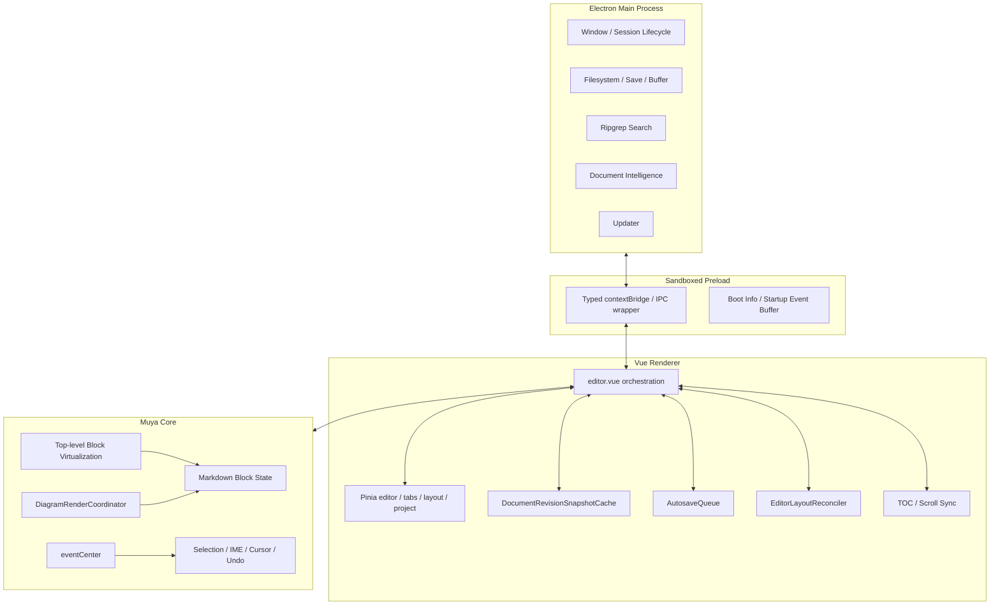
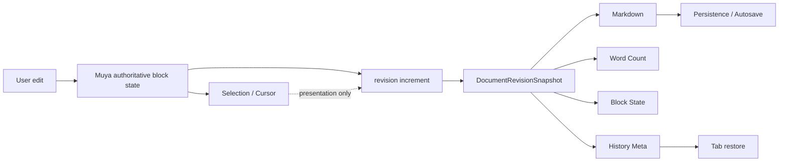
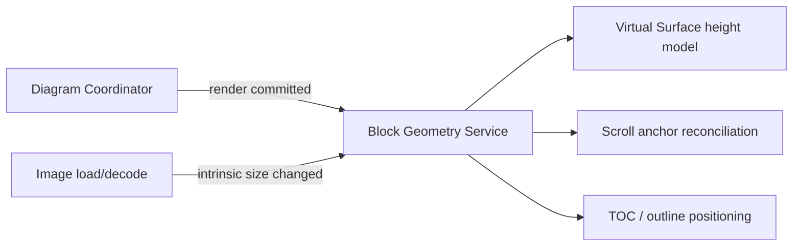
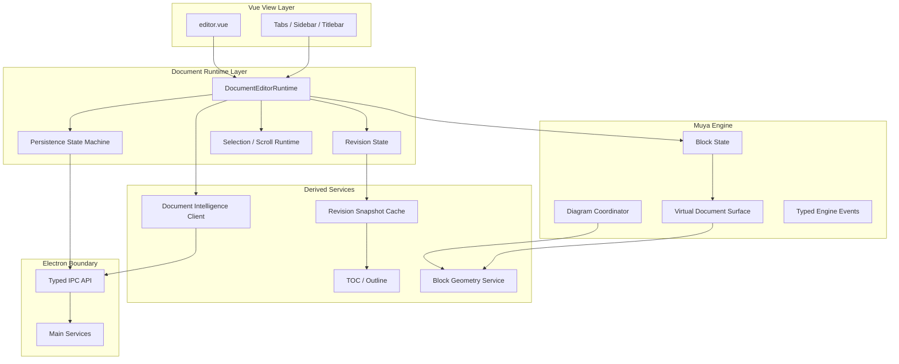

# Inkiva 架构审计（2026-09）

> 审计基线：PR-C 已合并代码树 `f11df84b79c6a10b8a441c8f0e6dbcc84bb57aac`。该代码已于 2026-09-19 合入 `develop`，对应 merge commit `780a1216892789c1c0b6b10a1b3f27964ae955e1`。
>
> 本文档只做架构审计与后续重构规划，不代表相应重构已经完成。所有图表均使用 Mermaid。

## 1. Executive Summary

Inkiva 当前已经从原始 MarkText 风格的“功能聚合型桌面应用”开始向更明确的文档编辑器架构收敛，但仍处于**新架构骨架已经出现、核心编排尚未彻底拆分**的阶段。

本轮审计的核心结论是：

1. **编辑器热路径架构已经有实质改善，不应再描述为纯补丁堆叠。**  
   `DocumentRevisionSnapshotCache` 已把 Markdown、word count、blocks、history meta 按 document revision 缓存；PR-C 引入顶层 Block Virtualization；图表有统一的 `DiagramRenderCoordinator`；编辑器 DOM 几何变化有 `EditorLayoutReconciler`。这些都是具备清晰职责边界的架构模块。

2. **当前最大的结构性风险仍在 renderer 编排层。**  
   `packages/desktop/src/renderer/src/components/editorWithTabs/editor.vue` 同时协调 Muya 生命周期、revision snapshot、selection/cursor、history、TOC、布局、滚动恢复、主题、打印/导出、性能探针等。它已经形成明显的 **God-component tendency**。最近新增的子模块降低了局部复杂度，但主编排入口仍然过重。

3. **authoritative state / derived state 的方向已经正确，但尚未形成单一 Document Runtime 边界。**  
   `DocumentRevisionSnapshotCache` 明确了“内容 revision”与展示状态的区分，这是正确方向；但 revision 推进、snapshot 捕获、synthetic history、Muya state、Pinia tab state、持久化触发仍由 `editor.vue` 跨模块串联，容易形成“逻辑一致、责任分散”的隐式协议。

4. **Electron 安全边界明显优于原始架构，但 typed IPC 迁移未完成。**  
   preload 已启用 sandbox/contextBridge，并将 IPC 调用集中到类型封装；`shared/types/ipc.ts` 也明确作为单一 channel contract。但该文件仍保留若干 `unknown` 参数/返回值，例如 `mt::rg::start`，renderer 中也仍存在较多直接按 channel name 调 `window.electron.ipcRenderer.send(...)` 的使用点。边界已经建立，但尚未完全类型闭合。

5. **图表“各管各”的历史问题已经被大幅收敛，但布局与生命周期仍存在双层协调。**  
   `packages/muya/src/utils/diagram/coordinator.ts` 已统一并发、缓存、generation、cancel/dispose 和写回保护；`EditorLayoutReconciler` 只观察顶层 block，避免 SVG/canvas 子树反复 mutation 直接冲击页面布局。当前风险不再是 Mermaid/PlantUML 各自完全独立，而是 **Muya 内图表调度 + Desktop 外层 layout reconciliation + virtualization geometry** 三套机制之间仍依赖协议协同。

6. **搜索与文档智能整体已经异步化，但后台任务治理尚未统一抽象。**  
   ripgrep 使用 main process handler、searchId、cancel、ack、match batch；这符合“Async Everything Else”。但 search、document intelligence、diagram、snapshot、TOC refresh 等各自维护 scheduler/queue/cancel 语义，缺少统一的后台任务优先级和生命周期模型。

综合判断：**当前不需要推翻编辑器内核重做架构，但需要进行一轮“边界收敛型重构”。** 下一阶段重点不应继续直接往 `editor.vue` 堆功能，而应把现有已验证的 snapshot、layout、virtualization、history、persistence 能力提升为明确的 runtime/service boundary。

---

## 2. 审计范围与验证方法

本次审计采用以下证据：

- 当前工程真实文件结构；
- renderer / main / preload / shared IPC 代码；
- Muya virtualization、diagram coordinator、eventCenter 代码；
- revision snapshot、autosave queue、editor layout reconciler；
- PR-C 已合并的性能与正确性改造；
- 已存在的 unit/E2E/performance gate 设计。

状态分类：

| 状态 | 含义 |
| --- | --- |
| 已解决 | 已存在明确架构模块和保护性测试，主要问题已经被结构化消除 |
| 部分解决 | 已有正确方向，但职责或协议仍散落在多个层 |
| 未解决 | 仍存在明显架构风险，且没有稳定边界 |
| 观察项 | 当前未形成实际故障，但规模继续扩大后可能成为问题 |

优先级：

- **P0**：可能破坏文档正确性、数据安全、编辑主链稳定性；
- **P1**：明显增加维护成本、回归风险或阻碍后续性能演进；
- **P2**：长期演进问题，可在稳定边界建立后逐步处理。

---

## 3. Current Architecture



### 当前架构的关键特点

- Electron main 已按 `filesystem`、`session`、`windows`、`update`、`documentIntelligence`、`ipc` 等目录拆分。
- preload 是明确的安全边界，并集中暴露 Electron 能力。
- renderer 使用 Pinia，但核心编辑运行时仍由 Vue component 自己编排。
- Muya TS 版本已经成为核心编辑引擎，legacy `packages/muyajs` 仍保留，形成迁移期双引擎结构。
- 大文档渲染已从 progressive render 进一步升级为 top-level block virtualization。

---

## 4. Key Findings / Risk Matrix

| 编号 | 发现 | 状态 | 优先级 | 主要影响 |
| --- | --- | --- | --- | --- |
| A-01 | `editor.vue` 仍是核心 God-component tendency | 未解决 | P1 | 改动耦合、回归面扩大、难以独立测试 |
| A-02 | authoritative/derived state 已引入 revision snapshot，但 runtime owner 仍分散 | 部分解决 | P1 | 保存、history、tab restore 之间容易出现隐式时序协议 |
| A-03 | 顶层 Block Virtualization 已解决 O(N) DOM 主问题 | 已解决 | P0 风险已显著下降 | 500K/1M 可用性提升 |
| A-04 | virtualization 与 selection/IME/DOM Range 强耦合 | 观察项 | P1 | 后续任何虚拟化深化都可能破坏编辑语义 |
| A-05 | 图表 coordinator 已统一，但布局/虚拟化仍是跨层协议 | 部分解决 | P1 | 高度变化、滚动锚点、卸载重挂风险 |
| A-06 | typed IPC 框架存在，但部分 channel 仍为 `unknown`，renderer 仍直接使用 channel string | 部分解决 | P1 | IPC schema 漂移、重构安全性不足 |
| A-07 | ripgrep 已具备 cancel/ack/batch，但后台任务缺少统一优先级模型 | 部分解决 | P2 | 多后台任务并发时可能争抢 CPU/IPC |
| A-08 | Muya + muyajs 双引擎迁移尚未完成 | 未解决 | P1 | 重复逻辑、行为差异、维护成本 |
| A-09 | layout observer 生命周期已有 destroy/reset 测试 | 已解决 | P1 风险下降 | 减少 observer 泄漏和重复回调 |
| A-10 | 性能门禁已较完整，但 reference runner 属于基础设施依赖 | 部分解决 | P1 | “CI 绿色”与“参考机门禁通过”仍必须区分 |
| A-11 | website 与 desktop 在 monorepo 中但 CI 边界不一致 | 观察项 | P2 | 发布一致性依赖人工/脚本约束 |

---

## 5. Detailed Audit

### 5.1 Electron Main / Preload / Renderer

#### 已解决

`packages/desktop/src/preload/index.ts` 顶部明确说明：

- renderer sandbox；
- Node/Electron 能力只通过 contextBridge；
- IPC 通过 `@shared/types/ipc` 泛型约束；
- startup-sensitive events 有 buffer，避免 renderer bundle 尚未注册 listener 时丢事件。

这是正确的 Electron 安全与启动架构。

`packages/desktop/src/shared/types/ipc.ts` 也明确把 IPC 划分为：

- invoke；
- send；
- sync；
- main -> renderer event。

#### 部分解决

IPC contract 文件自身注明 migration 期间 argument/return 仍允许 `unknown`。真实代码中例如：

```ts
'mt::rg::start': { args: [req: unknown]; ret: { searchId: string } }
```

同时 renderer 多处仍直接：

```ts
window.electron.ipcRenderer.send('mt::...')
```

这意味着“channel name 被统一约束”已经完成一部分，但“业务 payload schema 完全闭合”尚未完成。

#### 建议

不要新建另一套 IPC 框架。继续完成现有 contract migration：

1. 把 search、window/session、open-file、preferences 等高频 channel 的 `unknown` 收紧；
2. renderer 禁止新增 raw channel string；
3. 新 channel 必须先定义 shared contract 再实现 handler/caller。

---

### 5.2 Renderer 编排：`editor.vue`

这是当前最明显的架构压力点。

从真实代码看，`editor.vue` 同时导入并协调：

- `DocumentRevisionSnapshot`；
- `EditorLayoutReconciler`；
- TOC refresh / scroll sync；
- Pinia editor/project/preferences；
- print/pdf；
- theme；
- synthetic history；
- performance milestone/probe；
- Muya instance；
- selection / cursor；
- tab scroll restore。

内部同时持有：

- scroll handler/timer；
- TOC scheduler；
- snapshot scheduler；
- layout reconciler；
- revision snapshot；
- history restore；
- editor initialization。

因此它不是普通 Vue view，而是事实上的 **Editor Runtime Orchestrator**，但这个职责目前没有显式类型和生命周期边界。

#### 风险

当后续继续增加：

- autosave；
- recovery；
- backlink；
- AI/document intelligence；
- image/diagram；
- multi-tab optimization；

如果都继续接到 `editor.vue`，任何一个动作都可能改变初始化、切 tab、恢复 selection、序列化、layout reconciliation 的时序。

#### 建议目标

把 `editor.vue` 降级为：

- mount/unmount；
- props/store binding；
- UI event forwarding；
- renderer presentation。

把实际运行时编排迁移到 `DocumentEditorRuntime`。

---

### 5.3 Authoritative State / Revision Snapshot / Save

`packages/desktop/src/renderer/src/services/documentRevisionSnapshot.ts` 已建立：

- documentId + revision；
- markdown；
- wordCount；
- blocks；
- historyMeta；
- inFlight 去重；
- cost-based cache；
- metrics；
- prune。

源码注释也明确：

> Presentation-only state (selection/scroll/theme) never advances the content revision.

这是本项目目前最重要的架构进步之一。

`editor.vue` 已通过：

- `currentRevision(id)`；
- `getMarkdown(...)`；
- `readMarkdown(...)`；
- `getBlocks(...)`；
- `getHistoryMeta(...)`；

减少同一 revision 重复 `getMarkdown()` / `getState()`。

#### 仍存在的问题

revision snapshot 是 service，但 revision 生命周期仍由 `editor.vue` 调度；synthetic history、Muya native history、Pinia current file、autosave queue 并没有被一个统一 Document Runtime owner 管理。

因此当前状态更像：



方向正确，但 ownership 还没有完全收口。

#### 目标

`DocumentEditorRuntime` 应成为 revision 的唯一 owner：

- engine change -> advance revision；
- snapshot service 只做 derived cache；
- persistence 只消费指定 revision；
- tab restore 只消费 immutable runtime snapshot；
- selection/scroll 永不推进 content revision。

---

### 5.4 Render Surface 2.0 / Virtualization

PR-C 已把大文档策略正式推进到 top-level Block Virtualization。

`packages/muya/src/block/scrollPage/index.ts` 中已经存在：

- `_virtualBlocks`；
- `_virtualBlockIndexes`；
- `_virtualMountedIndexes`；
- `_virtualMaterializedIndexes`；
- virtual offsets/window；
- resize correction；
- ResizeObserver；
- interaction cancellation；
- teardown。

这已经不是“progressive render 最后仍全量挂 DOM”的旧结构。

#### 已解决

- scroll hot path 不再遍历全部虚拟 block；
- 500K/1M 不再要求全量 DOM；
- responsive resize 会重新校准虚拟高度；
- real user interaction 可以取消 resize correction；
- Ctrl/Cmd+Home/End 等逻辑边界行为已有针对 virtualization 的实现。

#### 必须保持的架构红线

**不要虚拟化 inline token、行或字符。**

selection、IME、DOM Range、undo/redo 与 Muya block tree 已经高度耦合。顶层 block 是当前可接受的最小稳定虚拟化单元。

任何进一步的细粒度 virtualization 都必须视为“编辑器内核重构”，不能作为普通性能 PR。

---

### 5.5 Selection / IME / Undo / DOM Range

当前 Muya 的 selection/cursor 行为依赖真实 DOM 节点，而 virtualization 会动态 materialize/unmount block。

PR-C 的策略是：

- logical block tree 保持完整；
- viewport 外 block 可以从 DOM 释放；
- selection/cursor 目标需要时 reveal/pin/materialize；
- history state 与 DOM 生命周期分离。

这是合理的折中。

#### 风险

这里存在一个长期不可消除的架构耦合：

> “逻辑文档完整”与“可编辑 DOM 仅部分挂载”之间必须有稳定桥梁。

因此应增加一个明确的 `VirtualDocumentSurface` API，而不是让 selection、scroll、layout 分别读取 virtualization 私有结构。

建议暴露最小契约：

- `ensureBlockMaterialized(blockId)`；
- `getLogicalBlockIndex(blockId)`；
- `getVisibleRange()`；
- `pinRange(reason)`；
- `releasePin(reason)`。

---

### 5.6 Diagram / Image / Layout

#### Diagram

`packages/muya/src/utils/diagram/coordinator.ts` 已经提供：

- 默认并发数 2；
- bounded cache；
- generation；
- cancellation；
- stale writeback guard；
- dispose；
- renderer adapter；
- cache key 包含 type/source/theme/PlantUML endpoint。

这说明过去“每种图表自己管渲染”的问题已经被明显收敛。

#### Layout

`packages/desktop/src/renderer/src/util/editorLayout.ts` 明确只观察 editor direct block children：

> Diagram renderers mutate descendants many times while producing SVG/canvas output; the parent block is the smallest stable layout boundary.

该模块：

- MutationObserver 只负责结构变更；
- ResizeObserver 负责 block geometry；
- rAF 合批；
- dirty blocks 局部测量；
- removed block 保留旧 geometry；
- destroy/reset 生命周期明确。

这直接解决了过去图表尺寸变化导致滚动高度/scroll anchor 混乱的一大类问题。

#### 剩余风险

现在不是“每种图表宽度各自维护”的问题，而是：

- diagram render coordinator；
- editor layout reconciler；
- virtual block estimated height；

三者仍然通过 DOM geometry 隐式协同。

建议把“block geometry changed”提升为明确事件：



Desktop 不需要知道 Mermaid/PlantUML 细节，只应该知道“某个顶层 block geometry 已改变”。

---

### 5.7 Search / Index / Document Intelligence

`packages/desktop/src/main/ipc/ripgrep.ts` 已使用：

- `searchId`；
- cancellation；
- sender destroy cleanup；
- file/text 两种 search；
- renderer 侧 ack/match/end/error channel。

这说明搜索已经不是 renderer 同步扫目录。

Document Intelligence 在 main process 独立目录中实现，并且标准 Markdown link parser 明确只解析普通相对 Markdown link，符合“不发明 Inkiva 私有语法”的产品原则。

#### 剩余问题

后台任务目前按功能分别拥有：

- search queue/protocol；
- document intelligence；
- diagram coordinator；
- snapshot scheduler；
- TOC scheduler；
- autosave queue。

这些模块各自合理，但缺少统一的优先级原则。

建议定义 scheduler policy，而不是统一成一个巨型 scheduler：

1. Editor critical：输入、selection、cursor、undo/redo；
2. Persistence critical：save/autosave；
3. Visible derived：TOC、visible diagram、visible image；
4. Interactive background：search；
5. Passive background：index/backlink/history prune/update check。

重点是共享优先级语义，而不是共享实现。

---

### 5.8 Muya / muyajs 双引擎

工程说明明确：

- `packages/muya` 是当前 TypeScript editor engine；
- `packages/muyajs` 是 legacy engine，正在退出；
- 仍存在少量 legacy alias/call site。

这属于真实架构债务。

#### 风险

只要双引擎仍存在：

- bug fix 可能修一边漏一边；
- diagram/image/selection 行为可能漂移；
- build alias 容易掩盖真实依赖；
- 新开发者无法快速判断 authoritative implementation。

#### 建议

单独开迁移 PR，不与性能 PR 混合：

- 建 legacy import inventory；
- 禁止新增 `@marktext/muyajs` import；
- 一次迁移一个 capability；
- 最终删除 legacy package 前跑完整 Markdown compatibility + desktop E2E。

---

### 5.9 Autosave / Persistence / Session

`packages/desktop/src/renderer/src/store/autosaveQueue.ts` 已体现：

- per-document pending；
- in-flight；
- timer；
- revision acknowledgement；
- cancel/dispose；
- teardown 时失败不会永久堵住 queue。

这说明 autosave 不再是简单 debounce。

但 autosave 的 revision 语义与 `DocumentRevisionSnapshot` 仍然由外部调用约定连接。

#### 建议

把 persistence contract 固定为：

```ts
persist(documentId, revision, markdown)
```

并要求：

- main ack 带 revision；
- 旧 revision ack 不覆盖新 revision 状态；
- save status 只从 persistence state machine 派生；
- window/session close 必须等待或明确放弃特定 revision。

---

## 6. Recommended Target Architecture



核心原则：

1. Vue component 不拥有复杂编辑生命周期；
2. revision 只能由 Document Runtime 推进；
3. derived service 不反向修改 authoritative state；
4. virtualization 对外只提供 surface contract；
5. diagram/image 统一汇入 block geometry；
6. main/renderer 只通过 typed IPC contract；
7. background work 必须有明确优先级和 cancellation。

---

## 7. PR Roadmap

### ARCH-01：Editor Runtime Extraction — P1

**目标：** 从 `editor.vue` 抽出显式 `DocumentEditorRuntime`，但不改变用户行为。

先测试：

- tab switch；
- editor mount/unmount；
- revision advance；
- history restore；
- selection restore；
- source mode switch；
- save/autosave handoff。

实现：

- runtime owns Muya instance lifecycle；
- runtime owns snapshot scheduler；
- runtime exposes narrow commands/events；
- Vue 只负责 UI binding。

成功标准：`editor.vue` 不再直接编排 snapshot/history/persistence 的时序。

### ARCH-02：IPC Contract Closure — P1

**目标：** 完成高频 IPC payload 强类型化，禁止新增 raw channel string。

先测试：

- compile-time contract tests；
- search payload；
- open/save/session/window；
- preferences。

实现：

- 收紧 `unknown`；
- 添加领域 request/result type；
- renderer command 只使用 preload domain API。

这不是性能 PR。

### ARCH-03：Virtual Surface Contract — P1

**目标：** selection/layout/scroll 不直接依赖 virtualization 内部字段。

先测试：

- Home/End；
- 大范围 selection；
- IME；
- undo/redo；
- responsive resize；
- tab restore。

实现：

- `VirtualDocumentSurface` 接口；
- materialize/pin/reveal API；
- 内部 virtual set/map 保持私有。

### ARCH-04：Block Geometry Unification — P1

**目标：** diagram/image/async block size change 统一进入 geometry service。

先测试：

- Mermaid；
- PlantUML；
- Vega；
- image lazy load；
- resize；
- virtual offscreen remount；
- scroll anchor。

实现：

- geometry change event；
- layout reconciler / virtual surface / TOC 消费统一 geometry update。

这是“架构 + 正确性”PR；只有实际降低测得热路径成本时才能称性能优化。

### ARCH-05：Legacy MuyaJS Retirement — P1/P2

**目标：** 清理 `packages/muyajs` 剩余生产依赖。

先做 import inventory 和 compatibility tests，再逐项迁移。

### ARCH-06：Background Work Priority Policy — P2

**目标：** 明确 search/index/diagram/TOC/update 等后台任务优先级、取消与资源预算。

不要做单一巨型 scheduler；只统一 policy 和 instrumentation。

### ARCH-07：Website / Release Boundary Contract — P2

**目标：** 把 website、desktop version、release notes、artifact contract 的一致性纳入发布 contract。

---

## 8. Validation Strategy

架构 PR 必须继续遵循测试优先。

### Unit

- Document Runtime state machine；
- revision monotonicity；
- persistence ack ordering；
- virtual surface pin/reveal；
- geometry batching；
- IPC schema。

### Integration

- renderer + Muya；
- diagram -> geometry -> scroll；
- revision snapshot -> save；
- search IPC cancellation。

### Electron E2E

- large document edit；
- tab switch；
- source/WYSIWYG switch；
- IME；
- selection；
- save/autosave；
- diagram/image reflow；
- responsive layout。

### Performance

性能 PR 必须继续使用相同：

- environment；
- workload；
- sample count；
- statistics；
- threshold。

架构 PR 如果没有 Before/After，不得宣传为性能提升。

### Release

保持：

- Windows x64；
- macOS Intel；
- macOS Apple Silicon；
- updater integration；
- Release Artifact Contract；
- version consistency。

---

## 9. 当前最值得保护的架构成果

后续重构不应破坏以下已经形成的正确边界：

1. `DocumentRevisionSnapshotCache` 的 revision-aware derived cache；
2. top-level Block Virtualization，不下沉到行/token/字符；
3. `DiagramRenderCoordinator` 的并发、cache、generation、cancel/dispose；
4. `EditorLayoutReconciler` 顶层 block geometry batching；
5. sandboxed preload + typed IPC single contract；
6. ripgrep main-process async/cancel/ack 模式；
7. performance gate fail-closed 原则。

---

## 10. Known Limits

本审计不声称：

- 已对每一个历史文件逐行人工审阅；
- 已证明所有 observer/timer 均不存在泄漏；
- 已完成 architecture PR 的实现；
- 已证明当前所有性能门禁在 reference runner 上通过。

特别说明：

- PR-C 已合并且普通 CI 为绿色，但 reference performance runner 是独立基础设施条件；
- 本文的“已解决”表示相关架构问题已有明确实现与测试保护，不等于该领域以后不会再出现缺陷；
- `editor.vue` 的拆分必须以行为不变为前提，不应为了追求文件大小而机械拆文件。

---

## 11. Final Conclusion

Inkiva 当前已经跨过“只有补丁、没有架构”的阶段，但还没有完成从 MarkText 历史结构向 Inkiva 自己的编辑器 runtime 架构迁移。

下一轮最有价值的工作不是继续发散新抽象，而是把已经验证有效的模块收口：

> **Document Runtime owns editing lifecycle; Muya owns document semantics; derived services stay revision-aware; Electron stays behind typed IPC; all non-editing work remains cancellable and lower priority.**

如果只选择一个架构 PR，优先做 **ARCH-01 / Editor Runtime Extraction**。它不会直接宣称性能提升，但会显著降低后续 save、virtualization、diagram、autosave、recovery 和 document intelligence 继续演进时的耦合风险。