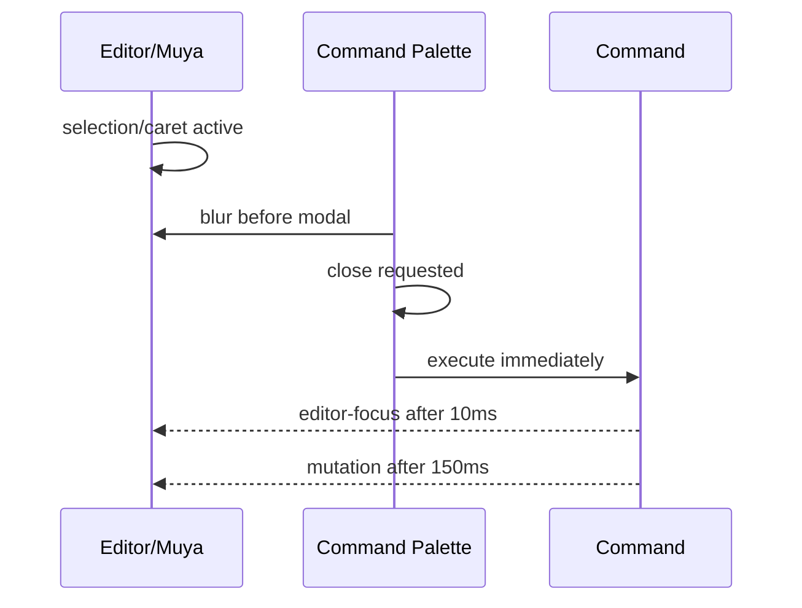
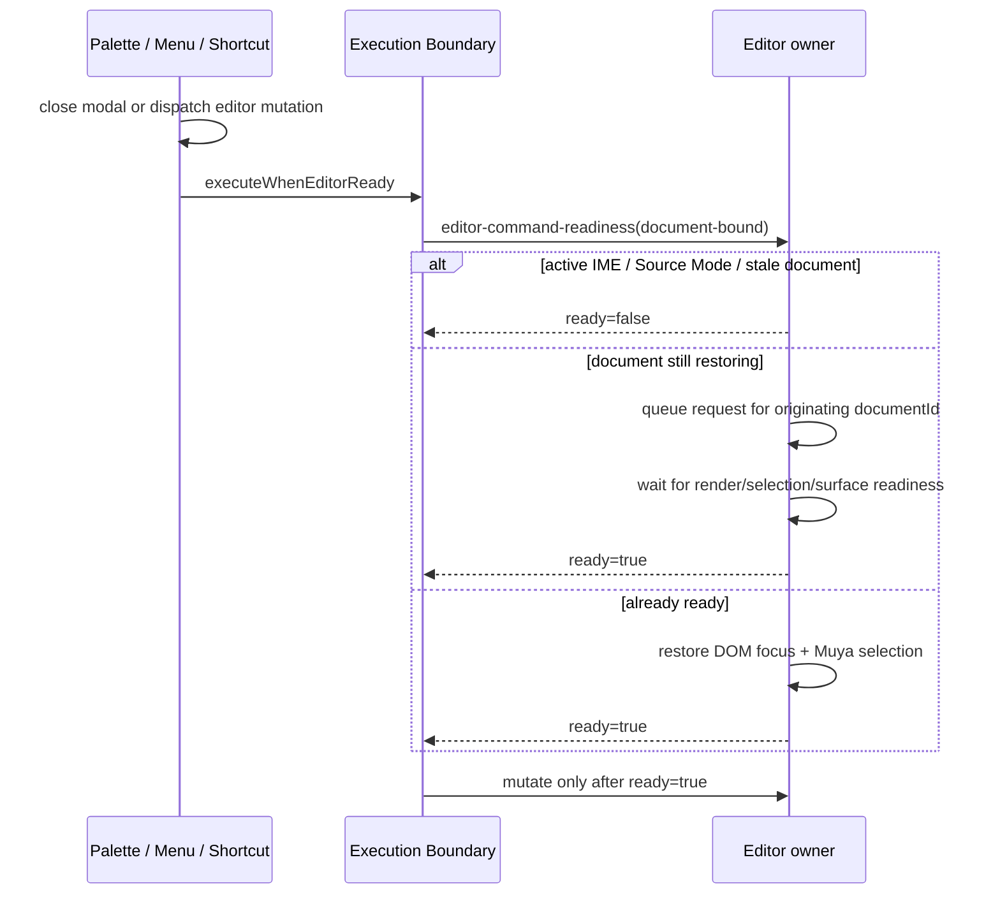

# CORRECTNESS-01 — Command Focus Readiness

## Status

- Branch: `correctness/command-focus-readiness`
- Base: `develop@677f96e168e3043b42464bbaaca55948a68c44dc`
- Current stage: **Stage 6 local closure complete / branch pushed / GitHub PR & CI status confirmation pending**
- Scope: editor-context command focus / selection / active-document readiness only.

## Problem

Commands that require editor context currently do not have a deterministic readiness boundary. The highest-risk path is command-palette execution: the palette closes, focus is requested after an arbitrary delay, and the edit action runs after another arbitrary delay.

The task goal is to replace timing guesses with an explicit:

```text
Command
  -> resolve active editor/document
  -> satisfy required focus/selection readiness
  -> execute
```

without creating a second editor lifecycle owner.

## Stage 1 — Current-state audit

### Confirmed evidence

1. `packages/desktop/src/renderer/src/commands/index.ts` defines `focusEditorAndExecute` as:
   - emit `editor-focus` after 10 ms;
   - execute the requested editor action after 150 ms.
2. The helper is used by undo/redo, paragraph commands, inline-format commands, and focus/typewriter view commands.
3. `components/commandPalette/index.vue` closes the dialog by assigning `showCommandPalette = false` and immediately invokes `execute()` / `executeSubcommand()`.
4. The palette's `@close` callback currently only clears palette state. It does not acknowledge that focus-trap teardown or editor-context restoration is complete.
5. The editor's `editor-focus` bus handler is synchronous and only calls `editor.focus()`; there is no acknowledgement that DOM focus, selection and active document are all ready.
6. Opening the palette intentionally blurs the editor to prevent Element Plus focus-trap restoration from fighting Muya selection state. This proves palette close and editor restore are a real lifecycle boundary rather than a cosmetic delay.
7. ARCH-08 explicitly left this path unresolved and required a future deterministic `dialog closed -> editor focus/selection ready -> command execute` contract with selection/IME/undo coverage.

### Readiness dimensions

The audit confirms these states must remain distinct:

- **Document Ready** — the command resolves the current active document/editor instance, not a stale tab.
- **Focus Ready** — the correct editor owns DOM/editor focus after modal/popup teardown.
- **Selection Ready** — the editor selection/caret used by the command is the intended pre-command selection.
- **Composition Safe** — readiness restoration must not terminate or corrupt a live IME composition session.

### Architecture constraints

The new boundary must preserve:

- ARCH-01 `DocumentEditorRuntime` as editor lifecycle/document ownership;
- ARCH-05 typed renderer bus rather than direct component coupling;
- ARCH-06 Muya public boundary;
- no arbitrary timeout/retry as a correctness mechanism.

No product code has been changed during Stage 1.

## Stage 2 — Reproduction plan

First red gate:

- focused source-contract test proving the command-palette/editor-command path still uses arbitrary timing and has no close/readiness acknowledgement.

Behavior-level follow-up:

- Electron E2E: select text -> open palette -> execute `format.strong` -> first invocation formats the original selection;
- command palette -> undo/redo;
- rapid tab switch -> immediate command targets only the new active tab;
- IME/composition regression around command restoration.

## Root-cause hypothesis

Current ownership is split across three asynchronous actors:



The delays approximate modal teardown and selection restoration but do not observe either condition. Therefore event emission is currently being treated as readiness.

## Next action

Add and run the focused red contract. Only after a product-red assertion is observed may production implementation change.

## Stage 2 — Failing reproduction

Stage 2 is complete.

The first local Vitest attempt did not reach test discovery because this Windows worktree does not have a package-local Vitest launcher. The documented donor-launcher fallback then hit the already-known `tinyexec/index.js` dependency-graph signature. Both are environment evidence and were not counted as product failures.

A dependency-independent Node built-in contract gate was therefore added and executed:

```text
node --test scripts/correctness-01-command-focus-readiness.test.mjs
```

Before production changes it failed on the real source assertions for both defects:

1. arbitrary 10 ms / 150 ms command timing;
2. palette close request followed by synchronous command execution.

That is the Stage 2 red evidence.

## Stage 3 — Root cause confirmed

The root cause is a **lifecycle-readiness race**, not a missing `focus()` call.

The old path conflated four distinct facts:

1. the dialog has been asked to close;
2. the dialog/focus trap has actually finished closing;
3. the active editor owns DOM focus and has restored its Muya selection;
4. the active document/editor is valid for mutation.

An emitted `editor-focus` event was treated as though all four were true, then a 150 ms delay was used as a probability-based substitute for acknowledgement.

IME adds a fifth condition: a command must not steal focus while composition is active.

## Stage 4 — Readiness contract implemented

The implementation now uses this deterministic chain:



### Contract details

- The palette stores a single pending command and executes it from Element Plus `closed`, not `close`.
- `packages/desktop/src/renderer/src/services/editorCommandReadiness.ts` is the single renderer execution boundary used by command-center commands and main-process menu/keyboard mutation ingress.
- The typed renderer bus exposes `editor-command-readiness` with an explicit resolver callback.
- The mounted editor component remains the readiness owner; its bus handler is disposed by the existing `DocumentEditorRuntime` lifecycle.
- A readiness request captures the **originating documentId**. If the user switches again before it becomes ready, the stale request resolves `false` and can never fall through to the newer document.
- Tab/file changes invalidate readiness synchronously. Requests wait for the existing `runWhenEditorRenderComplete` lifecycle and, when scroll restoration hides the surface, also wait for the surface to become visible.
- Readiness rejects when there is no current editor/document, Source Mode owns the surface, or an IME composition is active.
- `compositionstart` rejects pending readiness rather than stealing focus or terminating the composition session; `compositionend` re-enables subsequent commands normally.
- Successful readiness restores both DOM focus (`domNode.focus()`) and Muya selection (`focus()`) and verifies focus before acknowledging.
- Menu/keyboard format and paragraph actions, plus editor-context edit actions such as Undo/Redo/Select All/clipboard mutations, use the same readiness boundary. Find/Find-in-Folder UI actions are intentionally not forced through editor focus readiness.
- Focus Mode and Typewriter Mode are view-only commands and do not pass through selection-context readiness.
- No timeout, sleep, retry, or second-trigger behavior is used as the correctness mechanism.

### Removed workaround

The historical command timing workaround has been removed:

```ts
setTimeout(() => bus.emit('editor-focus'), 10)
setTimeout(() => fn(), 150)
```

The legacy pattern `close palette -> synchronously execute mutation` has also been removed.

## Stage 5 — Regression coverage and validation

### Focused contract gate

```text
node --test scripts/correctness-01-command-focus-readiness.test.mjs
```

Current result: **5/5 passed**.

The gate proves:

1. arbitrary command focus/execution timers are absent;
2. palette execution is behind the `closed` lifecycle;
3. pending readiness is bound to the originating document;
4. menu/keyboard mutation ingress uses the same readiness boundary;
5. view-only commands are not misclassified as selection-context commands.

A Vitest mirror exists at:

```text
packages/desktop/test/unit/specs/correctness-01-command-focus-readiness.spec.ts
```

### Electron E2E added

1. **Command Palette / selection**
   - select `Palette`;
   - open palette;
   - execute `format.strong`;
   - first invocation must produce `# **Palette**`.

2. **Tab switch / immediate shortcut**
   - prepare and persist a selection in tab B;
   - switch to A;
   - issue `A -> B` and immediately press Ctrl/Cmd+B without waiting for B render;
   - readiness must queue against B;
   - B becomes bold and A remains unchanged.

3. **IME / composition**
   - select editor text;
   - dispatch `compositionstart`;
   - Ctrl/Cmd+B must not mutate or steal the composition;
   - after `compositionend`, the same shortcut must work immediately on the preserved selection.

The existing repository IME tests continue to cover synthetic Chinese composition commit behavior; native OS candidate-window behavior remains a platform acceptance concern rather than something Playwright can fully emulate.

### Local environment evidence

Local dependency-backed validation could not start from this worktree:

- package-local Vitest launcher is absent;
- documented donor Vitest fallback hits the existing incomplete dependency-graph signature (`tinyexec/index.js`);
- donor `vue-tsc` fails before type analysis on `estree-walker` package exports;
- donor `electron-vite build` fails before compilation because the donor/root graph cannot resolve `cac/index.js`.

These are bootstrap/dependency-graph failures and are **not counted as product-code failures**, consistent with `AGENTS.md` / `docs/agent/ENVIRONMENT.md`. No product assertion was weakened and the temporary root `node_modules` Junction was removed.

### Validation still required

CI must provide the authoritative dependency-backed evidence for:

- TypeScript/Vue type checking;
- Vitest focused/integration suite;
- Electron E2E including the three CORRECTNESS-01 paths above;
- existing editing/selection/undo/redo/tab/IME regression suites.

## Stage 6 — Local closure status

Completed locally:

1. complete committed-range review: `677f96e1..b205478c`, 12 files changed, production/tests/docs all represented;
2. workspace hygiene: **pass**, clean worktree, no untracked artifacts;
3. focused Node contract gate: **5/5 passed**;
4. CRLF-aware diff whitespace validation: **passed**;
5. isolated branch committed in two implementation/test commits and pushed to `origin/correctness/command-focus-readiness`.

Current branch head:

```text
b205478c test: satisfy correctness lint gate
73da5472 fix(editor): enforce command focus readiness
```

GitHub PR/CI status is the only remaining external closure item. During this stage both `gh pr view` and a read-only `git ls-remote refs/pull/*/head` query stalled at the remote/network boundary and were terminated; no repository mutation depended on those calls.

Remaining external closure:

1. confirm/create the PR for `correctness/command-focus-readiness -> develop`;
2. observe all required CI checks, including the dependency-backed Vitest/typecheck/Electron E2E gates;
3. fix only evidence-backed failures if CI exposes any;
4. after green CI, record PR/merge state and final lessons here.

